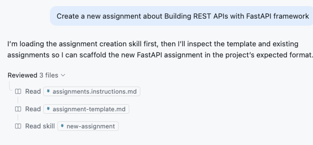
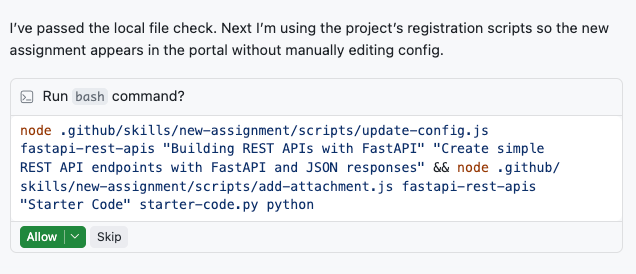

## Step 3: Building Reusable Skills

Now that you've established instructions for assignments, you want to streamline creating new assignments.

Creating assignments is a repetitive task and involves multiple steps, a perfect scenario for a reusable skill!

- Creating the assignment content
- Registering it in the website configuration
- Attaching starter code or data files

### 📖 Theory: Agent Skills

Agent Skills are an [open standard](https://agentskills.io/) for giving AI agents specialized capabilities and workflows. A skill is a folder containing a `SKILL.md` file with metadata and instructions, plus optional scripts, references, and other resources.

```text
skill-name/
├── SKILL.md          # Required: metadata + instructions
├── scripts/          # Optional: executable code
├── references/       # Optional: documentation
```

Agents discover skills automatically through **progressive disclosure**:

1. **Discovery**: At startup, agents load only the skill's `name` and `description`.
1. **Activation**: When a task matches a skill's description, the agent reads the full `SKILL.md` instructions.
1. **Resources**: Additional files (references, scripts) are loaded only when needed.

This means you can have many skills installed without slowing things down — only what's relevant gets loaded into context.

Skills get activated in two ways: **automatically** when Copilot matches your request to a skill's description, or **explicitly** via a slash command (`/skill-name`). Because agents rely on the `name` and `description` to decide which skills to activate, writing a clear, specific description is important.

Visual Studio Code discovers skills from the `.github/skills/` directory by default.

> [!TIP]
> Write a clear `description` in the frontmatter so the agent knows **when** to use the skill. Reference additional files for templates, examples, and detailed documentation.

See the [VS Code Docs: Agent Skills](https://code.visualstudio.com/docs/copilot/customization/agent-skills) for more information.

### ⌨️ Activity: Create the Skill Skeleton

Let's start by creating the full skill directory structure and its main `SKILL.md` file. We'll create all the directories upfront — including `references/` and `scripts/` — so everything is in place as we add files in the following activities.

1. Create the skill directory structure with all subdirectories:

   ```text
   .github/skills/new-assignment/
   .github/skills/new-assignment/references/
   .github/skills/new-assignment/scripts/
   ```

1. Create the main skill file:

   ```text
   .github/skills/new-assignment/SKILL.md
   ```

1. Add the following content. The frontmatter `name` and `description` are what the agent sees at discovery time to decide whether to activate the skill. The body provides the workflow the agent follows once activated.

   ```markdown
   ---
   name: new-assignment
   description: Create a new programming homework assignment for Mergington High School students. Use this skill whenever the user wants to create, add, scaffold, or generate a new assignment, exercise, or homework — even if they don't use the word "assignment" explicitly.
   ---

   # Create New Programming Assignment

   Assignments live in `assignments/<id>/`, and the website reads `config.json` to display them. Follow these steps to create both.

   ## Step 1: Gather Requirements

   If the user hasn't specified, ask what programming concept the assignment should cover.

   > 📖 Read [references/assignment-guide.md](references/assignment-guide.md) for guidance on difficulty, scope, and when to include starter code.

   ## Step 2: Create the Assignment

   1. Create `assignments/<kebab-case-id>/README.md` following the [assignment template](../../../templates/assignment-template.md)
   2. (Optional) Add starter code or data files to the same directory

   ## Step 3: Register with the Website

   Use the bundled scripts — do NOT edit `config.json` manually.

   **Register the assignment:**

       node .github/skills/new-assignment/scripts/update-config.js <id> "<title>" "<description>"

   **Register each file as an attachment** (starter code, data files, etc.):

       node .github/skills/new-assignment/scripts/add-attachment.js <id> "<display-name>" <filename> <type>

   Common types: `python`, `csv`, `json`, `txt`, `html`

   ## Step 4: Verify

   Confirm the assignment was registered correctly: check that `config.json` contains the new entry and that all created files exist on disk.
   ```

   Notice how the `SKILL.md` references two other directories — `references/` and `scripts/` — that we haven't created yet. This is the progressive disclosure pattern in action: the agent only loads these files when it reaches a step that needs them.

### ⌨️ Activity: Add a Reference Guide

Let's populate the `references/` directory with domain knowledge the agent can consult as needed. The `SKILL.md` points to `references/assignment-guide.md` so the agent can read it when deciding difficulty and scope — but only when it actually needs that context.

1. Create the reference file:

   ```text
   .github/skills/new-assignment/references/assignment-guide.md
   ```

1. Add the following content to give the agent pedagogical guidance:

   ```markdown
   # Assignment Design Guide

   Guidance for designing assignment content — what to teach and how to scope it. For formatting and markdown structure, the project's instruction files handle that automatically.

   ## Difficulty & Scope

   - Target 2–4 tasks per assignment that build on each other
   - Start with something a student can finish in under 10 minutes, then add complexity
   - The last task can be a stretch goal, but earlier tasks should build confidence
   - Stick to one core concept per assignment (e.g., "loops", not "loops + file I/O + error handling")

   ## Starter Code

   Include starter code when:

   - The assignment needs boilerplate the student shouldn't write from scratch
   - You want students to follow a specific function signature or structure

   Skip it when the point is writing something from scratch (e.g., "write a script that…").

   ## Example Topics by Difficulty

   - **Beginner**: variables, conditionals, loops, string formatting
   - **Intermediate**: functions, lists/dicts, file I/O, basic classes
   - **Advanced**: APIs, data analysis, testing, web frameworks
   ```

   By separating this from `SKILL.md`, we keep the main instructions focused on _workflow_ while this file provides _domain knowledge_. The agent only reads it when it reaches the gather-requirements step.

### ⌨️ Activity: Add Bundled Scripts

Skills can bundle scripts for deterministic tasks that are better handled by code than by the AI. Our skill needs two scripts: one to register the assignment in `config.json` and one to attach files (starter code, datasets, etc.) to it. Having the agent run these scripts ensures consistent, error-free config updates every time.

1. Create the first script that registers a new assignment:

   ```text
   .github/skills/new-assignment/scripts/update-config.js
   ```

   Add the following content:

   ```javascript
   const fs = require("fs");
   const path = require("path");

   const [id, title, description] = process.argv.slice(2);
   const configPath = path.resolve(__dirname, "../../../../config.json");
   const config = JSON.parse(fs.readFileSync(configPath, "utf8"));

   if (!id || !title || !description) {
     console.error(
       'Usage: node .github/skills/new-assignment/scripts/update-config.js <id> "<title>" "<description>"',
     );
     process.exit(1);
   }

   const dueDate = new Date(Date.now() + 7 * 24 * 60 * 60 * 1000).toISOString().split("T")[0];

   config.assignments.push({
     id,
     title,
     description,
     path: `assignments/${id}`,
     dueDate,
   });

   fs.writeFileSync(configPath, JSON.stringify(config, null, 2) + "\n");
   console.log(`Added "${title}" (due ${dueDate})`);
   ```

   This script handles the math for the due date and the exact JSON structure — things that are tedious and error-prone for an AI to get right every time.

1. Create a second script that attaches files to an existing assignment:

   ```text
   .github/skills/new-assignment/scripts/add-attachment.js
   ```

   Add the following content:

   ```javascript
   const fs = require("fs");
   const path = require("path");

   const [assignmentId, displayName, filename, type] = process.argv.slice(2);

   if (!assignmentId || !displayName || !filename || !type) {
     console.error(
       'Usage: node add-attachment.js <assignment-id> "<display-name>" <filename> <type>',
     );
     console.error(
       'Example: node add-attachment.js python-basics "Starter Code" starter-code.py python',
     );
     process.exit(1);
   }

   const repoRoot = path.resolve(__dirname, "../../../../");
   const configPath = path.join(repoRoot, "config.json");
   const filePath = path.join(repoRoot, "assignments", assignmentId, filename);

   // Verify the file exists on disk
   if (!fs.existsSync(filePath)) {
     console.error(`Error: File not found: assignments/${assignmentId}/${filename}`);
     process.exit(1);
   }

   const config = JSON.parse(fs.readFileSync(configPath, "utf8"));
   const assignment = config.assignments.find((a) => a.id === assignmentId);

   if (!assignment) {
     console.error(`Error: Assignment "${assignmentId}" not found in config.json`);
     console.error("Available IDs:", config.assignments.map((a) => a.id).join(", "));
     process.exit(1);
   }

   // Create attachments array if it doesn't exist
   if (!assignment.attachments) {
     assignment.attachments = [];
   }

   // Skip if an attachment with the same filename already exists
   const existing = assignment.attachments.find((a) => a.file === filename);
   if (existing) {
     console.log(`Skipped: "${filename}" is already attached to "${assignmentId}"`);
     process.exit(0);
   }

   assignment.attachments.push({
     name: displayName,
     file: filename,
     type: type,
   });

   fs.writeFileSync(configPath, JSON.stringify(config, null, 2) + "\n");
   console.log(`Added "${displayName}" (${filename}) to assignment "${assignmentId}"`);
   ```

   This second script validates that the file actually exists, prevents duplicate attachments, and produces clear error messages — all things that make the skill more robust when the agent executes it.

1. Review the final skill structure. It should look like this:

   ```text
   .github/skills/new-assignment/
   ├── SKILL.md                          # Workflow the agent follows
   ├── references/
   │   └── assignment-guide.md           # Domain knowledge (loaded on demand)
   └── scripts/
       ├── update-config.js              # Registers new assignments
       └── add-attachment.js             # Attaches files to assignments
   ```

   Each part of the skill has a clear role:
   - **`SKILL.md`** — the agent's playbook: what steps to follow and when to load other resources
   - **`references/`** — background knowledge that helps the agent make better decisions
   - **`scripts/`** — deterministic operations handled by code instead of AI generation

### ⌨️ Activity: Test the Assignment Skill

1. Open Copilot Chat in VS Code and ensure you're in `Agent` mode.

1. Ask Copilot to create a new assignment using a natural language prompt. Because the skill has a clear `description`, Copilot will automatically match your request and activate it.

   > 
   >
   > ```prompt
   > Create a new assignment about Building REST APIs with FastAPI framework
   > ```

   > 💡 **Tip:** You can also invoke the skill explicitly with the `/new-assignment` slash command in the chat input.

      <details>
      <summary>💡 Assignment Topic Ideas</summary>

   ```text
   Python Text Processing - working with strings, file I/O, and text manipulation
   ```

   ```text
   Data Structures in Python - lists, dictionaries, sets, and tuples
   ```

   ```text
   Python Data Visualization - using matplotlib or plotly for charts and graphs
   ```

   ```text
   Building REST APIs with FastAPI framework
   ```

   ```text
   Statistics with Python - data analysis and statistical calculations using pandas and numpy
   ```

      </details>

1. Copilot will read the skill, create the assignment, and run the bundled scripts.

   

   Accept any confirmation prompts to let it continue.

   

1. Verify the new assignment appears in the assignments list on the website preview.

   <details>
   <summary>Assignment not showing? 🔍</summary>

   Check these items:
   - Refresh the page.
   - A new directory was created in `assignments/`.
   - The `config.json` file was updated with the new assignment.

   </details>

1. Review the generated assignment content to ensure it matches your established conventions.

1. Commit and push your changes:
   - The new skill directory: `.github/skills/new-assignment/` (including `SKILL.md`, `references/`, and `scripts/`)
   - The generated assignment directory and files.
   - Updated `config.json` configuration.

1. Wait for Mona to prepare the next step!

<details>
<summary>Having trouble? 🤷</summary><br/>

- Make sure the skill is in the `.github/skills/new-assignment/` directory with a `SKILL.md` file.
- The `name` field in `SKILL.md` frontmatter must match the parent directory name (`new-assignment`).
- If the skill doesn't appear in the `/` menu, reload the VS Code window.

</details>
