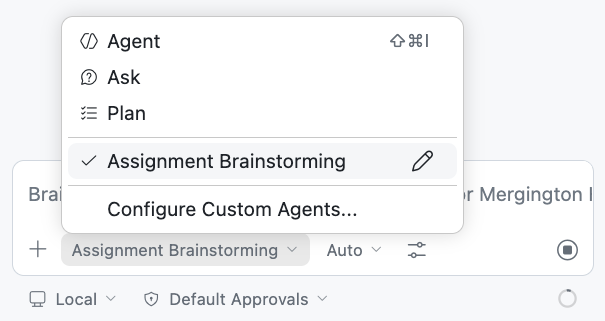
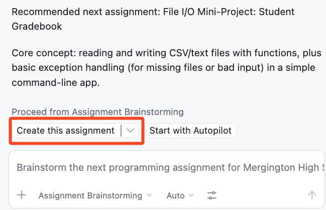

## Step 4: Creating Custom Agents

Now that you have instructions, skills, and templates working together, you want to take customization one step further. When brainstorming new assignments, you'd like a specialized chat experience that focuses purely on ideation — and then hands off to Agent Mode to actually implement the assignment creation using the skill you built in Step 3.

### 📖 Theory: Custom Agents

Custom agents (`*.agent.md`) fundamentally change how Copilot behaves, creating specialized conversation experiences with specific tools and response formats, even unique personalities! They are selected from a dropdown list in the Copilot Chat interface.

Visual Studio Code will look for `*.agent.md` files in `.github/agents/` directory.

> [!TIP]
> Learn more about Custom Agents:
>
> - [VS Code Docs: Custom Agents](https://code.visualstudio.com/docs/copilot/customization/custom-agents)
> - [GitHub Docs: Custom Agents Configuration](https://docs.github.com/en/copilot/reference/custom-agents-configuration)

### ⌨️ Activity: Create an Assignment Brainstorming Custom Agent

Now let's create a specialized custom agent that helps brainstorm assignment ideas, then hands off to Agent Mode to actually implement the assignment creation using the skill you built in Step 3.

1. Create a new file called:

   ```text
   .github/agents/assignment-brainstorming.agent.md
   ```

1. Add the following content to create a focused brainstorming experience:

   ```markdown
   ---
   name: Assignment Brainstorming
   description: Brainstorm the next programming assignment for Mergington High School students
   tools: ["search", "vscode/askQuestions"]
   handoffs:
     - label: "Create this assignment"
       agent: agent
       prompt: "Create a new assignment based on the recommendation from the brainstorming session above."
       send: true
   ---

   # Assignment Brainstorming Assistant

   Help the teacher decide on the next assignment by analyzing existing curriculum and suggesting one focused idea.

   ## Workflow

   1. Scan the `assignments/` directory and `config.json` to understand what topics are already covered.
   2. Use the `askQuestions` tool to gather the teacher's preferences — difficulty level, topic area, and any constraints.
   3. Recommend **one** assignment: a title, the core concept, and a sentence on why it fills a curriculum gap.
   4. Suggest using the **Create this assignment** button to build it.

   ## Rules

   - Keep responses short — no more than a few sentences per section.
   - Never write full assignment specs. That's the skill's job.
   - Base recommendations on gaps in the existing curriculum.
   - Always end with a clear next step.
   ```

   Let's break down the key parts:
   - **`tools: ["search", "vscode/askQuestions"]`** — gives the agent the ability to search the codebase and present structured questions with selectable options, rather than relying on free-text back-and-forth.
   - **`handoffs`** — defines a "Create this assignment" button. When clicked, it switches to the regular Copilot Agent mode and automatically sends a prompt referencing the brainstormed recommendation. This should trigger the `new-assignment` skill from Step 3 so that the assignment is actually created based on the brainstormed idea.
   - **The body instructions** — define the agent's personality and workflow. Notice it's focused on _ideation only_ and explicitly defers implementation to the skill.

### ⌨️ Activity: Test the Brainstorming Custom Agent

1. Open Copilot Chat in VS Code.

1. Select your custom agent from the agent dropdown list.

   

1. Start a brainstorming session:

   > 
   >
   > ```prompt
   > What should I teach next?
   > ```

1. The agent will scan your existing assignments, then ask you structured questions about difficulty and topic preferences. Answer the questions to narrow down the recommendation.

1. Once the agent recommends an assignment, click the **Create this assignment** button to hand off to Agent Mode for implementation.

   

1. Commit and push your changes to the `main` branch.

1. Wait for Mona to give you a final review!

<details>
<summary>Having trouble? 🤷</summary><br/>

- Make sure the custom agent file is in `.github/agents/` directory with the `.agent.md` extension.
- Custom agents are selected from the dropdown list at the bottom of the chat interface, not with `@` mentions.
- If the custom agent doesn't appear in the dropdown, restart VS Code or reload the window.

</details>
